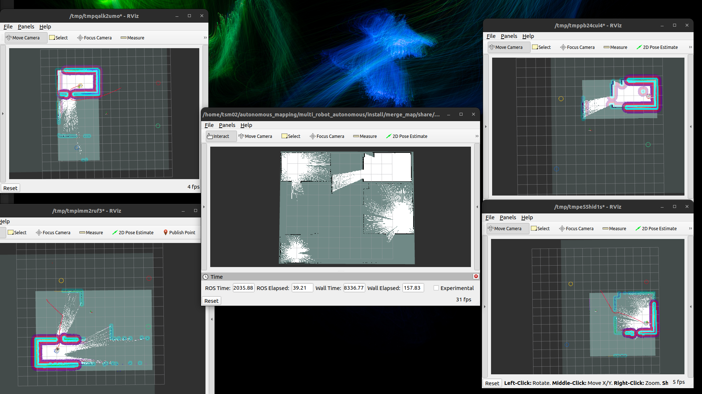
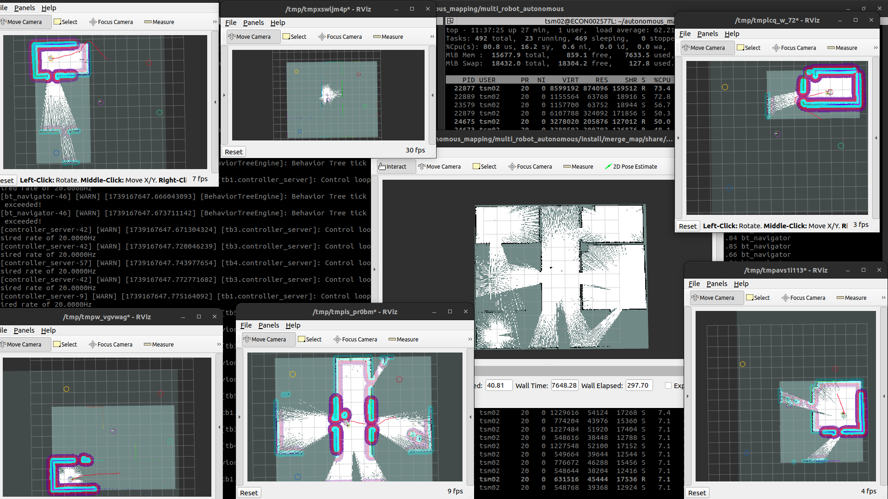

# Multi-Robot Autonomous Mapping (ROS 2)

This repository contains a complete ROS 2 workspace for **multi-robot autonomous mapping and navigation** using TurtleBot3, Nav2, and SLAM Toolbox. It supports multi-robot exploration, map merging, and autonomous navigation in Gazebo.

## 📁 Repository Structure

```
multi_robot_autonomous/
│
├── README.md
├── Technical_Manual.md
│
├── src/
│   ├── maps/
│   ├── merge_map/
│   ├── multi_robot/
│   ├── multi_robot_exploration/
│   ├── nav2_bringup/
│   ├── slam_toolbox/
│   ├── rviz2-panel/
│   ├── saved_map/
│   ├── utils/
│   └── worlds/
│
├── debug_files/
│   ├── autonomous_four_robot_mapping_frames.pdf
│   ├── autonomous_four_robot_mapping_rosgraph.png
│   ├── autonomous_four_robot_navigation_frames.pdf
│   ├── autonomous_four_robot_navigation_rosgraph.png
│   ├── autonomous_two_robot_mapping_without_nav2_rosgraph.png
│   └── view_frames_of_2robot.pdf
│
├── demo_videos/
│   ├── MULTI_ROBOT_MAPPING_2.webm
│   ├── MULTI_ROBOT_MAPPING_4ROBOTS.webm
│   ├── SINGLE_ROBOT_AUTONOMOUS_MAPPING.mp4
│   ├── SINGLE_ROBOT_AUTONOMOUS_MAPPING.webm
│   ├── cpu_usage_of_4_robots.png
│   ├── cpu_usage_of_6_robots.png
│   ├── rviz_launch_of_4_robots.png
│   └── rviz_launch_of_6_robots.png


```

---

## 🖼️ Screenshots & Performance Metrics

### RViz Launch Screens

**4 Robots in RViz**




**6 Robots in RViz**




## 🎥 Demo Videos

🔹 **2 Robot Mapping**  
▶️ [Watch Video](demo_videos/MULTI_ROBOT_MAPPING_2.webm)

🔹 **4 Robot Mapping**  
▶️ [Watch Video](demo_videos/MULTI_ROBOT_MAPPING_4ROBOTS.webm)

> These videos demonstrate autonomous multi-robot exploration, SLAM, and merged map generation in Gazebo.

---

## 🧩 System Requirements

* Ubuntu 22.04
* ROS 2 Humble
* Gazebo
* TurtleBot3 packages

---

## 📦 Dependencies Installation


### Install ROS 2 Humble (if not already installed)

```bash
sudo apt update
sudo apt install ros-humble-desktop
```

### 1. Install Navigation2

```bash
sudo apt update
sudo apt install ros-humble-navigation2
```

---


### 2. Install Workspace Dependencies via rosdep (Recommended)

* After cloning the repository, install all required system and ROS dependencies automatically using rosdep.

Source ROS 2 first:

```bash
source /opt/ros/humble/setup.bash
```

Then:

```bash
git clone https://git.e-consystems.net/tsm02/ros2_humble.git

cd ros2_humble/multi_robot_autonomous
rosdep update
rosdep install --from-paths src --ignore-src -r -y
```

This is the recommended way to ensure all required dependencies (e.g., Gazebo, RViz, TF tools, etc.) are installed before building.

---


### 3. Install Modified nav2_bringup and slam_toolbox

Reference repositories:

* nav2_bringup (original):
  [https://github.com/ros-navigation/navigation2/tree/humble/nav2_bringup](https://github.com/ros-navigation/navigation2/tree/humble/nav2_bringup)

* slam_toolbox (multirobot fork):
  [https://github.com/acachathuranga/slam_toolbox/tree/multirobot_ros2](https://github.com/acachathuranga/slam_toolbox/tree/multirobot_ros2)

Clone and build:

```bash
cd ros2_humble/multi_robot_autonomous
colcon build --cmake-clean-cache --symlink-install --packages-select nav2_bringup slam_toolbox
```

---


### 4. Install Multi-Robot Packages

Required packages:

* multi_robot_exploration
* merge_map
* multi_robot

Build them:

```bash
cd ros2_humble/multi_robot_autonomous
colcon build --cmake-clean-cache --symlink-install --packages-select \
  multi_robot_exploration \
  merge_map \
  multi_robot

source install/setup.bash
```

---


## 🚀 Launch Multi-Robot Mapping

### Launch Gazebo + RViz + Nav2 for Mapping

Example for **4 robots**:

```bash
ros2 launch multi_robot gazebo_multirobot_mapping_with_nav2.launch.py robot_count:=4
```

This will:

* Spawn multiple TurtleBot3 robots
* Start SLAM Toolbox
* Initialize Nav2
* Enable autonomous multi-robot exploration
* Merge maps from all robots


### Additional feature - Offline Map Merging

* Merge multiple partially mapped maps into a single map 

Specify the directory containing the partial map YAML files. The number of YAML files in the directory must match the robot_count parameter.

```bash
ros2 launch merge_map offline_merge_map_launch.py robot_count:=2 maps_directory:="~/debug_robot/maps/" frame_id:="map"
```

### Multi-Robot Navigation with Pre-built Map

To test multi-robot navigation using a map created from the multi-robot mapping launch:

```bash
ros2 launch multi_robot gazebo_multirobot_navigation.launch.py robot_count:=4
```

This will:

* Load the merged map from `src/multi_robot/maps/merged_map.yaml`
* Spawn multiple TurtleBot3 robots in Gazebo
* Start Nav2 navigation stack for each robot
* Launch RViz for each robot with individual configurations
* Allow goal assignment through RViz panels for autonomous navigation

---

## 🗺️ Features

* Multi-robot SLAM
* Autonomous exploration
* Map merging
* Nav2-based navigation
* Gazebo simulation
* RViz visualization
* Support for 2+ robots

---

## 📊 Architecture & Debug Files

The repository includes:

* ROS graphs (`*.png`)
* TF frames (`*.pdf`)
* RViz configurations
* [Technical Manual](Technical_Manual.md)

These are useful for:

* Debugging
* System understanding
* Academic / research documentation

---

## 📝 Notes

* This workspace uses **modified versions** of Nav2 and SLAM Toolbox for multi-robot support.
* Make sure to source your workspace after build:

```bash
source /opt/ros/humble/setup.bash
source install/setup.bash
```

* It is recommended to add these to your ~/.bashrc for convenience.

If you use this project for research or demos, please cite or reference appropriately.

